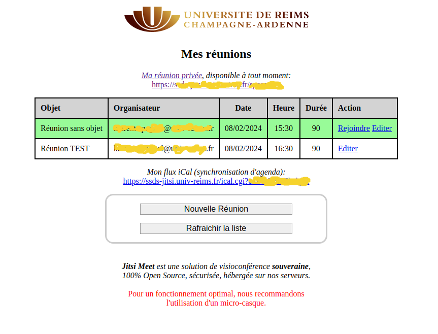
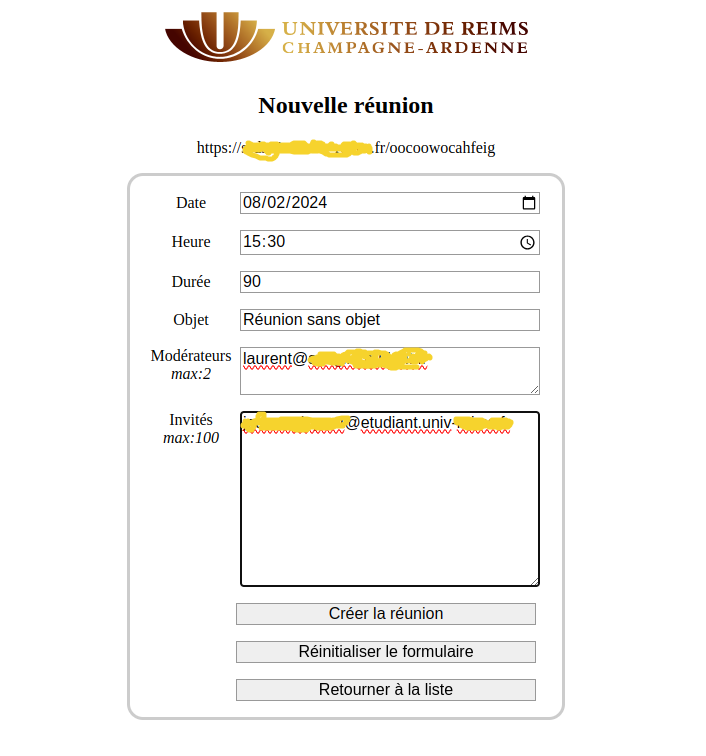

# Jitsi Meet Booking (JMB)

## Fonctionnalités:

* **Authentification universelle** JWT / modules d'authentication Apache.
  * CAS, Shibboleth, SAML, LDAP, SQL, ...
* **Réservation et planification** des réunions.
* Gestion des **invités**.
* Gestion des **modérateurs**.
* Les invités peuvent accepter/décliner les invitations.
* Un **modérateur peut être un utilisateur externe** (ne pouvant pas s'authentifier).
* **Rappels par mail** (début des réunions).
* **Rappels par XMPP** (fin des réunions).
* **Flux iCal** pour la synchronisation des agendas.
* Le status "accepté/décliné" des invités est disponible dans le flux iCal et **TODO** l'interface de gestion.

## Historique:
**JBM** a été écrit en quelques jours au début du premier confinement de la crise Covid pour proposer une solution de visioconférence souveraine et peu coûteuse à nos utilisateurs.
L'idée de départ était de fournir un outil de planification simple à utiliser: seuls les utilisateurs authentifiés pouvaient planifier, démarrer et modérer les réunions.
L'authentification était assurée par Shibboleth et la planification par l'API de réservation de Jicofo.
**JMB** a intégré, dès le départ, un mécanisme de rappels par mail et un flux iCal pour la synchronisation des agendas.
Malheureusement, les développeurs de Jitsi ont supprimé le support de Shibboleth et modifié l'API de réservation.
**Jitsi Meet** évolue très rapidement, l'authentification par Shibboleth n'étant plus supportée, il était indispensable de modifier **JMB** pour passer à **JWT**.
**JMB** exploite le comportement de Jitsi (les utilisateurs authentifiés sont modérateurs, les utilisateurs non authentifiés ne le sont pas) pour contourner l'API de réservation.

**JMB** a donc été modifié en profondeur:
* Authentification **JWT** / modules auth Apache,
* le stockage des données passe d'une arborescence de fichiers plats à une base SQLite,
* ajout du rôle de *modérateur* (un modérateur n'étant pas nécessairement un utilisateur qui peut s'authentifier),
* amélioration du flux iCal (il contient l'état accepté/décliné des invitations de chaque participant).

## Fonctionnement:
* Le GCI **booking.cgi**:
  * est **protégé par un module d'authentification Apache** (par défaut: *auth_cas*),
  * permet à un utilisateur authentifié de planifier des réunions et de modifier celles qu'il a créé,
  * affiche la liste des réunions planifiées (réunions créés par l'utilisateur et celles auxquelles il est invité en tant que participant ou modérateur),
  * permet d'accéder aux réunions planifiées
    * redirection via **token.cgi** pour les propriétaires,
    * redirection via **join.cgi** pour les participants ou modérateurs,
  * permet d'inviter des participants et/ou des modérateurs,
  * les participants et/ou des modérateurs peuvent être des *utilisateurs externes* (ne pouvant pas s'authentifier),
  * génère, pour une réunion donnée, un *hash individuel* pour chaque participants et/ou modérateur,
  * expédie un mail de notification à chaque participant,
  * le mail de notification contient des liens qui permettent d'accepter/rejeter l'invitation.

* Le CGI **token.cgi**:
  * est **protégé par un module d'authentification Apache** (par défaut: *auth_cas*),
  * n'est invoqué que par le propriétaire d'une réunion,
  * génère un jeton **JWT** et l'ajoute en paramètre lors de la redirection vers *Jitsi*.

* Le CGI **join.cgi**:
  * n'est pas protégé par une authentification (chaque participant a un *hash individuel*),
  * est invoqué par les modérateurs et les invités,
    * **modérateurs**: il génère un jeton **JWT** et l'ajoute en paramètre lors de la redirection vers *Jitsi*,
    * **invités**: il redirige directement vers *Jitsi*.

* Le CGI **ical.cgi**:
  * n'est pas protégé par une authentification (chaque utilisateur a un *hash individuel*),
  * génère un flux iCal permettant de synchroniser des agendas (Thunderbird, Smartphone, Nextcloud, ...),
  * le flux iCal contient le status des invités (invitation accptée/déclinée),
  * son utilisation est implicitement limitée aux utilisateurs qui peuvent accéder à **booking.cgi** (utilisateurs pouvant s'authentifier).

* Le CGI **invitation.cgi**:
  * n'est pas protégé par une authentification (chaque utilisateur a un *hash individuel*),
  * permet aux invités d'indiquer leur présence à l'organisateur d'une réunion (accepter/décliner l'invitation).

* *Les CGI en Bash, c'est moche, mais j'ai pas le temps de tout ré-écrire en Python ... avis aux volontaires ! ;)*

## Prérequis:

* Testé sur **Ubuntu 22.04**, *devrait fonctionner* sur **Debian 12**.
* Un compte permettant d'accéder à l'annuaire LDAP de votre organisation.
* Un SSO fonctionnel (par défaut: serveur **CAS**).
* Un MTA (Postfix) configuré pour relayer les mails.
* Le serveur *Jisti Meet* **DOIT** être installé, configuré et fonctionnel avec l'authentication JWT.
  * -> voir [README-install_jitsi-meet-tokens.md](README-install_jitsi-meet-tokens.md)
* Synchronisation iCal dans *Nextcloud*: votre instance Nextcloud doit pouvoir joindre votre serveur Jitsi
  * -> tcp/443 ouvert en sortie sur le serveur Nextcloud vers le serveur Jitsi

## Installation:

* Lancez le script d'installation et suivez les indications: `cd jitsi-jmb ; bash install.sh`
* 1ère exécution du script d'installation: redémarrez le serveur.
* **JMB** est déjà installé (mise à jour): le redémarrage n'est pas nécessaire.
* Vous avez un logo à afficher dans l'interface ? -> copiez-le dans */opt/jitsi-jmb/etc/logo.png*

## TODO

* Adapter *jitsi-jmb_show* au stockage SQLite
* ~~Corriger les rappels *xmpp*~~
* ~~Ajout -r ${mailfrom} à la commande mail si l'organisateur n'est pas sur le domaine du serveur Jitsi (fixer l'expéditeur d'enveloppe pour passer les contrôles SPF)~~
* ~~Créer un CGI "invitation.cgi" -> "accept" / "decline" + lien ajouté au mail de notification -> info ajoutée au flux iCal~~ + notification par mail à l'organisateur ?
* ~~Gérer le status "accept" / "decline" dans le CGI "ical.cgi"~~
* Préciser le status "accepté" / "décliné" des invitations dans le mail de rappel à l'organisateur
* ~~*jitsi-jmb_mail-reminder* ne doit pas envoyer de rappel aux participants qui ont décliné l'invitation~~
* Générer un hash iCal (si nécéssaire) pour les utilisateurs qui peuvent s'identifier lors de l'envoi des notifications, ajouter le lien vers le flux iCal dans les mails
* Ajouter un lien *Consulter* pour les proprios des réunions -> afficher le "accept" / "decline" des participants
* Générer et ajouter un contenu ICS aux notifications envoyés par mail

## Divers:

* [Plugins Munin](https://github.com/lspagnol/jitsi-jmb/tree/master/munin)
* [Exemples de fichiers de configuration](https://github.com/lspagnol/jitsi-jmb/tree/master/conf-samples)

## Références:

* Paramètres Jicofo: https://github.com/jitsi/jicofo/blob/master/jicofo-selector/src/main/resources/reference.conf
* Paramètres JVB: https://github.com/jitsi/jitsi-videobridge/blob/master/jvb/src/main/resources/reference.conf
* Générateur d'URLs Jitsi: https://shawnchin.github.io/jitsi-url-generator/

## Références **FIXME** (probablement obsolètes):

* https://github.com/jitsi/jitsi-meet/blob/master/doc/quick-install.md
* https://github.com/jitsi/jitsi-meet/wiki/jitsi-meet-with-Apache-on-Ubuntu-18.04-and-Shibboleth-Authentication
* https://github.com/jitsi/jicofo/blob/master/doc/reservation.md
* https://github.com/jitsi/jitsi-videobridge/blob/master/doc/rest.md
* https://github.com/jitsi/jitsi-videobridge/blob/master/doc/rest-colibri.md
* https://github.com/jitsi/jitsi-meet/blob/master/doc/turn.md
* https://community.jitsi.org/t/non-standard-characters-in-conference-room-name-request-result-in-404-error/18199/2
* https://doc.ubuntu-fr.org/prosody

